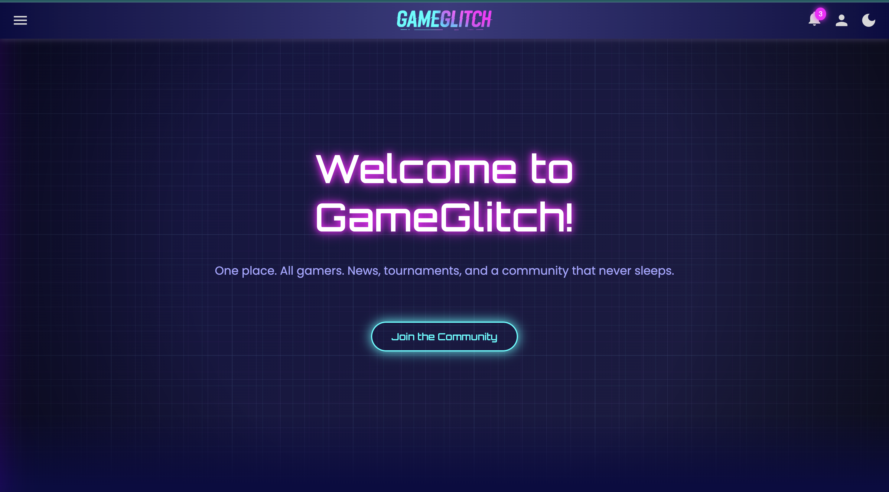

# GameGlitch 🎮

**GameGlitch** is a stylish gaming community website featuring the latest news, upcoming tournaments, and interactive forums for gamers worldwide. Built with clean, responsive design and smooth animations.

## 🔥 Features

- Responsive layout for desktop and mobile
- Sidebar navigation with animated burger menu
- Notification dropdown with smooth fade-in effect
- Account login/register dropdown with animations
- Auto-scrolling **Latest News** section with pause on hover
- Optimized images for faster loading
- Modern hover effects and neon-themed color palette

## 🚀 Live Demo

  

## 🛠️ Technologies Used

- **HTML5**  
- **CSS3**  
- **JavaScript** (Vanilla)  

## 📸 Preview

